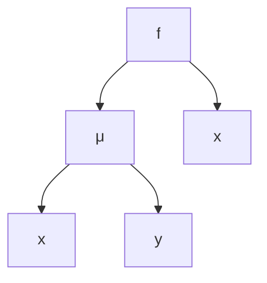
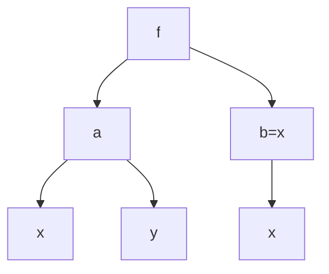

# 数学分析复合偏导内容优化

在《华东师范大学数学分析》（第五版）中，教材对于复合求导常见以下形式的树状图：

于是，当我想要对$x$进行求导时，结果如下：
$$
\frac{\partial{f}}{\partial{\mu}}\cdot\frac{\partial{\mu}}{\partial{x}}+\frac{\partial{f}}{\partial{x}}
$$
可是发现一个问题没有，如果我把它写完整：
$$
\frac{\partial{f}}{\partial{x}}=\frac{\partial{f}}{\partial{\mu}}\cdot\frac{\partial{\mu}}{\partial{x}}+\frac{\partial{f}}{\partial{x}}
$$
那不就意味着？
$$
\frac{\partial{f}}{\partial{\mu}}\cdot\frac{\partial{\mu}}{\partial{x}}=0
$$
可是事实真的如此吗，显然是否定的.

平时学习比较认真的同学可能会说：是你自己没看清好吧！

明明教材说了这两个$\frac{\partial{f}}{\partial{x}}$是不一样的含义，等号右边是把$\mu,x$分成了两个独立变量.

那么我想说的是，同样的符号有不同的所指，这本身就是一种很差劲的表示，何不妨这样写：

即，树状图的每一层都单独设出一种符号，避免不同背景下的偏导歧义.

那么此时：
$$
\frac{\partial{f}}{\partial{x}}=\frac{\partial{f}}{\partial{a}}\cdot\frac{\partial{a}}{\partial{x}}+\frac{\partial{f}}{\partial{b}}\cdot\frac{\partial{b}}{\partial{x}}
$$
由题设：
$$
b=x,\frac{\partial{b}}{\partial{x}}=\frac{\partial{x}}{\partial{x}}=1
$$
即：
$$
\frac{\partial{f}}{\partial{x}}=\frac{\partial{f}}{\partial{a}}\cdot\frac{\partial{a}}{\partial{x}}+\frac{\partial{f}}{\partial{b}}
$$
其中有确定的式子：
$$
f(a,b)=f(x,y)\\a(x,y)\\b(x)=x
$$
可见，这种表示方法要优于教材原版表示.

#### 注

此处：
$$
\frac{\partial{b}}{\partial{x}}
$$
由于为单变量函数，更常写作：
$$
\frac{db}{dx}
$$
但我认为无伤大雅，我乐意.